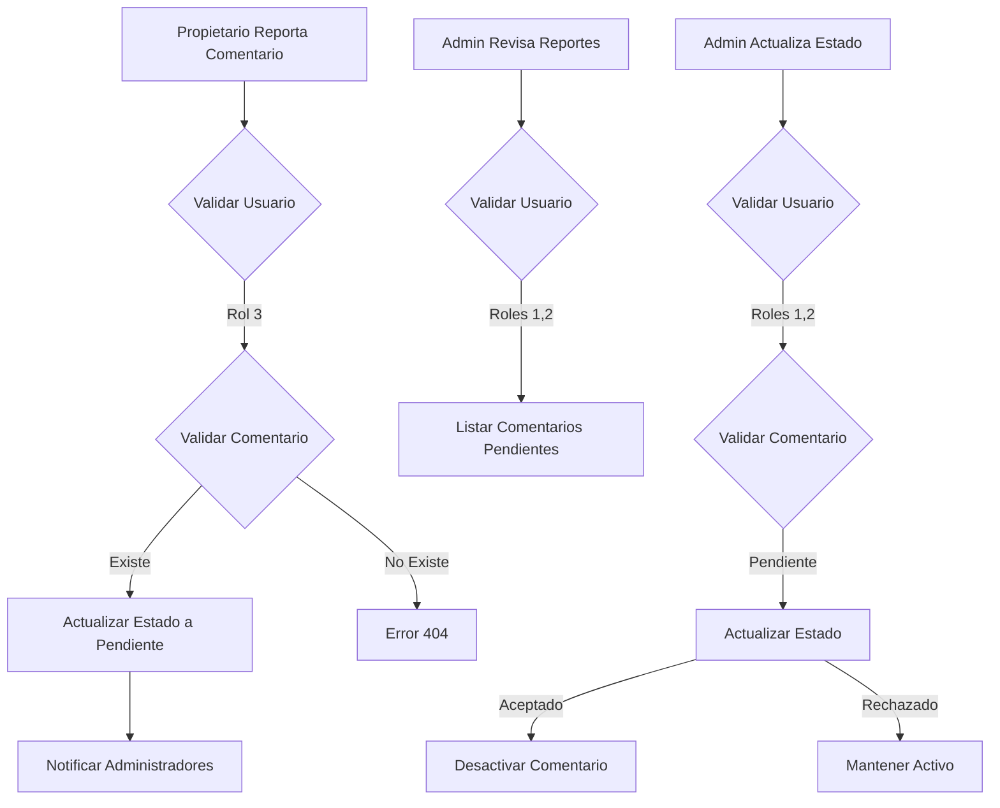

# Flujo de Reportes - API PopNocturna

## 1. Reportar un Comentario (Rol 3 - Propietario)

### Endpoint
```http
POST /api/comentario/:id/reportar
```

### Flujo
1. **Validación de Usuario**
   - Verifica que el usuario esté autenticado
   - Verifica que tenga rol 3 (Propietario)

2. **Validación del Comentario**
   - Verifica que el comentario exista
   - Verifica que el comentario no esté ya reportado
   - Verifica que el comentario no haya sido ya revisado

3. **Proceso de Reporte**
   - Actualiza el estado del comentario a `pendiente`
   - Guarda el motivo del reporte
   - Registra quién reportó el comentario
   - Registra la fecha del reporte

### Request
```json
{
  "motivo": "Contenido inapropiado"
}
```

### Respuestas Posibles

#### Éxito (200)
```json
{
  "mensaje": "Comentario reportado exitosamente",
  "comentario": {
    "id": 1,
    "estado": "pendiente",
    "contenido": "Comentario reportado",
    "motivo_reporte": "Contenido inapropiado",
    "fecha_reporte": "2024-02-20T15:30:00.000Z"
  }
}
```

#### Error - Comentario no encontrado (404)
```json
{
  "mensaje": "Comentario no encontrado"
}
```

#### Error - Ya reportado (400)
```json
{
  "mensaje": "Este comentario ya ha sido reportado y está pendiente de revisión"
}
```

## 2. Obtener Comentarios Reportados (Roles 1,2 - Administradores)

### Endpoint
```http
GET /api/comentario/reportados
```

### Flujo
1. **Validación de Usuario**
   - Verifica que el usuario esté autenticado
   - Verifica que tenga rol 1 o 2 (Admin/SuperAdmin)

2. **Obtención de Reportes**
   - Busca todos los comentarios con estado `pendiente`
   - Incluye información del usuario que hizo el comentario
   - Incluye información del evento relacionado
   - Incluye información del lugar del evento

### Respuestas Posibles

#### Éxito (200)
```json
{
  "mensaje": "Comentarios reportados obtenidos exitosamente",
  "comentarios": [
    {
      "id": 1,
      "contenido": "Comentario reportado",
      "fecha_hora": "2024-02-20T15:30:00.000Z",
      "aprobacion": "pendiente",
      "motivo_reporte": "Contenido inapropiado",
      "usuario": {
        "id": 1,
        "nombre": "Usuario 1",
        "correo": "usuario1@ejemplo.com"
      },
      "evento": {
        "id": 1,
        "nombre": "Evento 1",
        "lugar": {
          "id": 1,
          "nombre": "Lugar 1"
        }
      }
    }
  ]
}
```

#### Sin Reportes (200)
```json
{
  "mensaje": "No hay comentarios reportados pendientes de revisión",
  "comentarios": []
}
```

## 3. Actualizar Estado del Reporte (Roles 1,2 - Administradores)

### Endpoint
```http
PUT /api/reporte/comentario/:id/estado
```

### Flujo
1. **Validación de Usuario**
   - Verifica que el usuario esté autenticado
   - Verifica que tenga rol 1 o 2 (Admin/SuperAdmin)

2. **Validación del Comentario**
   - Verifica que el comentario exista
   - Verifica que el comentario esté en estado `pendiente`

3. **Proceso de Actualización**
   - Actualiza el estado de aprobación (`aceptado` o `rechazado`)
   - Si es `aceptado`, desactiva el comentario
   - Si es `rechazado`, mantiene el comentario activo
   - Registra el motivo de la decisión

### Request
```json
{
  "aprobacion": "aceptado",
  "motivo": "Motivo de la decisión"
}
```

### Respuestas Posibles

#### Éxito (200)
```json
{
  "mensaje": "Estado del reporte actualizado exitosamente",
  "reporte": {
    "id": 1,
    "aprobacion": "aceptado",
    "motivo_reporte": "Motivo de la decisión",
    "estado": false
  }
}
```

#### Error - Comentario no encontrado (404)
```json
{
  "mensaje": "Comentario no encontrado"
}
```

#### Error - Estado inválido (400)
```json
{
  "mensaje": "Estado no válido",
  "detalle": "El estado debe ser 'aceptado' o 'rechazado'"
}
```

## Diagrama de Flujo



## Notas Importantes

1. **Estados de Aprobación**
   - `pendiente`: Comentario reportado, esperando revisión
   - `aceptado`: Reporte aprobado, comentario desactivado
   - `rechazado`: Reporte rechazado, comentario activo

2. **Permisos por Rol**
   - Rol 3 (Propietario): Solo puede reportar comentarios
   - Roles 1,2 (Admin/SuperAdmin): Pueden ver y gestionar reportes

3. **Validaciones**
   - Un comentario no puede ser reportado dos veces
   - Solo comentarios activos pueden ser reportados
   - Solo administradores pueden cambiar el estado de los reportes

4. **Notificaciones**
   - Los administradores reciben notificación cuando hay nuevos reportes
   - El propietario recibe notificación cuando su reporte es procesado 